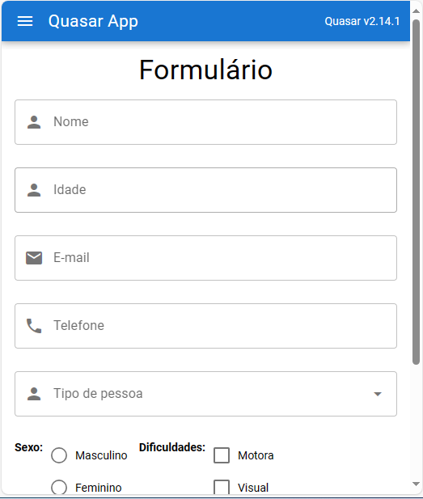

# Quasar App (formulario)

Exemplo de formulário do curso.
Neste projeto, usamos alguns recursos do quasar framework para simular a inserção e validação de dados no formulário.
Dentre os recursos utilizados, temos, input textfields, radio, checkbox, buttons, entre outros.
Abaixo se encontra o resultado final da janela.

## Resultado

