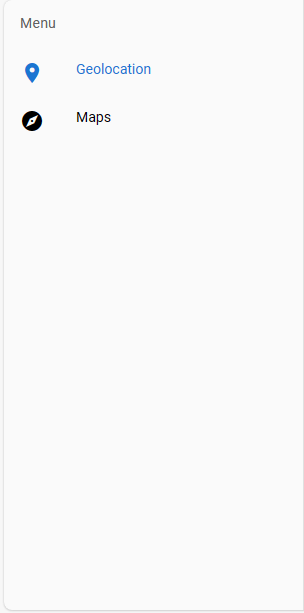
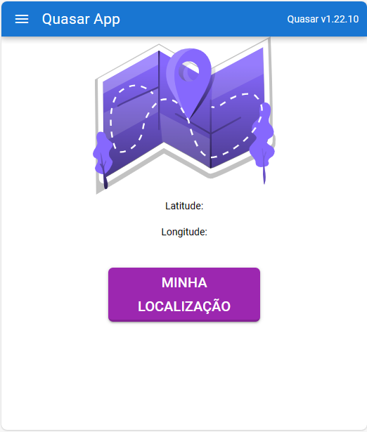
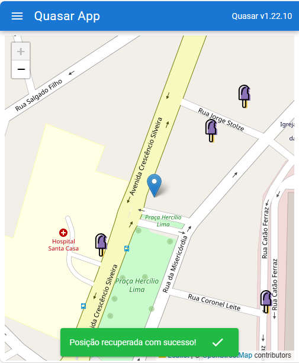

# Quasar App (quasa-geolocation-example)

No projeto QUASA-GEOLOCATION-EXAMPLE já foi possível implementar uma página melhor organizada, com menu lateral e duas páginas, uma com a função de mostrar a latitude e longitude atual e a outra mostra a localização atual num mapa. Confira abaixo o resultado.

## Resultado
###  Menu lateral

### Geolocation page

### Map page

