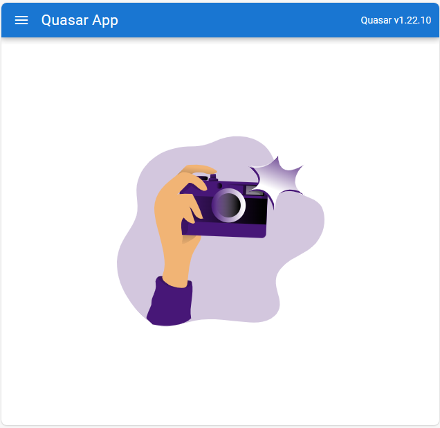
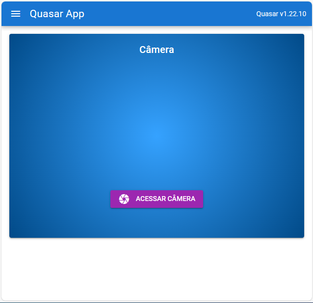

# Quasar App (quasar-camera-example)

O projeto QUASAR-CAMERA-EXAMPLE foi baseado no projeto de geolocalização, porem a página inicial conta apenas com uma imagem, já a outra, possui acesso a câmera do dispositivo e pode tirar fotos.

## Resultado
### Menu lateral

### Página inicial

### Câmera
 
