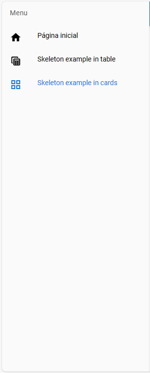
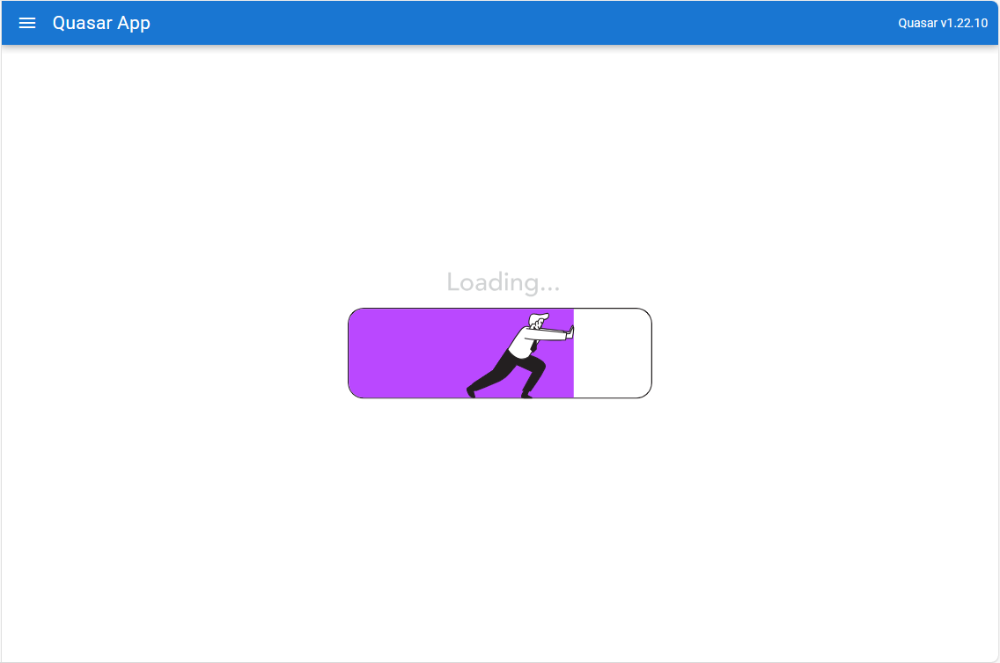
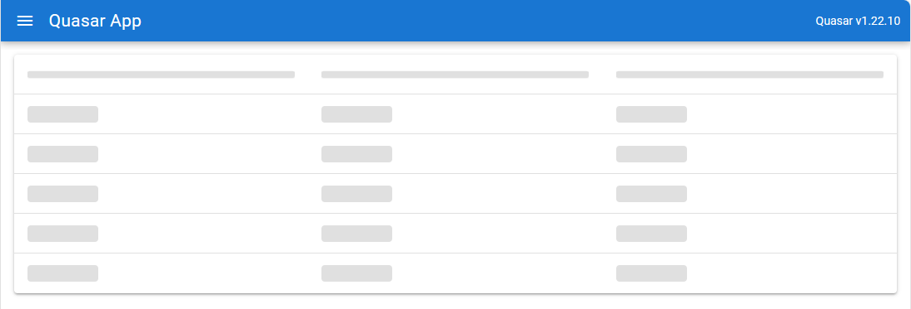
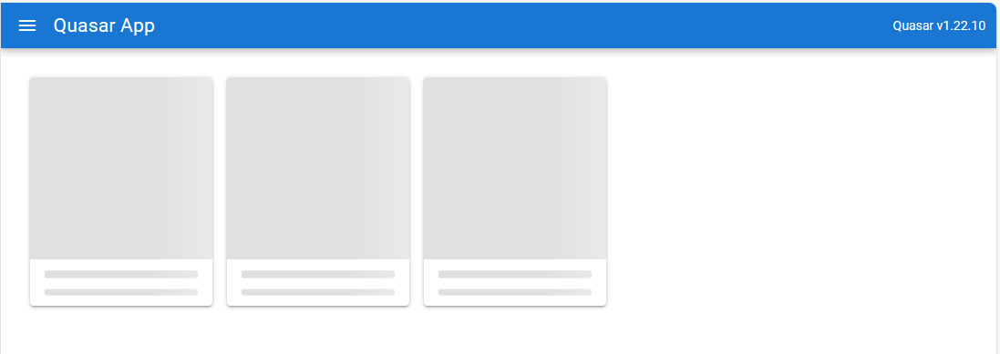

# Quasar App (skeleton-example)

O skeleton é um recurso interessante. Ao invés de deixar os usuários entediados ao esperar algum tipo de dado na sua aplicação, faça telas de carregamento customizadas para diferentes tipos de ambientes. Neste projeto, exemplifico em dois, tabelas e cards. Verifique o resultado abaixo.

## Menu lateral

## Página inicial

## Skeleton table

## Skeleton cards

