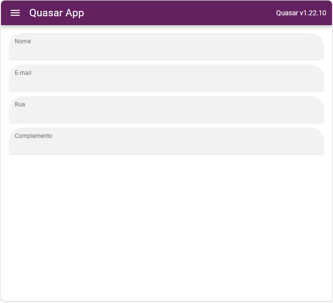

# Quasar App (quasar-visual-input)

Nesta última aula do curso, vamos aprender a padronizar entradas, ou seja, criar componentes que serão usados em outras páginas, e quando houver necessidade de alteração, esta pode ser feita apenas no componente principal.

## Resultado

