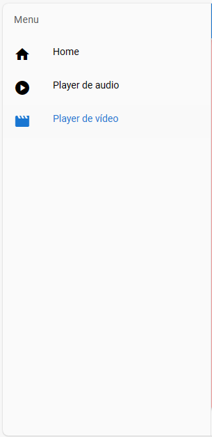
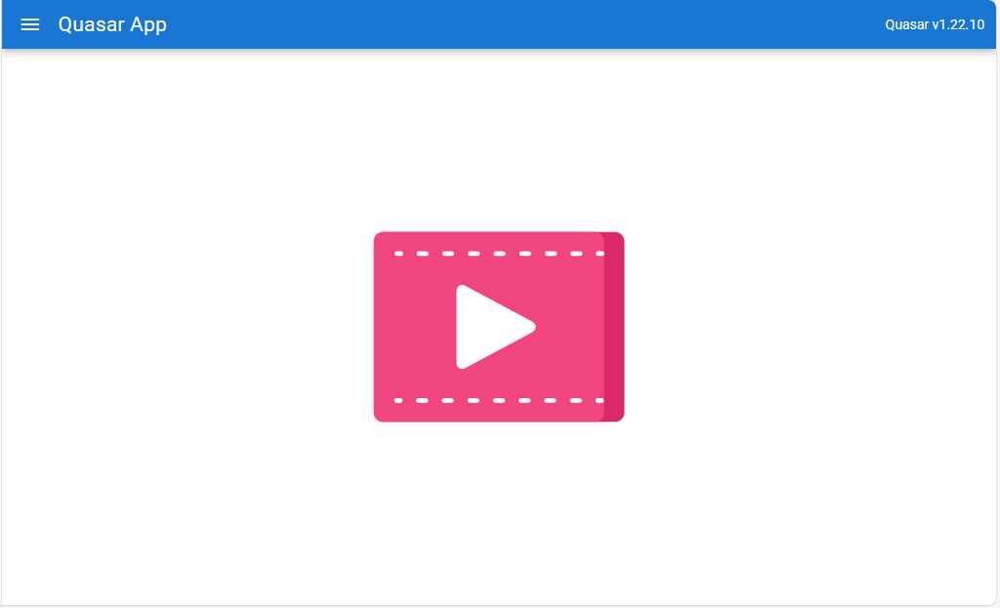
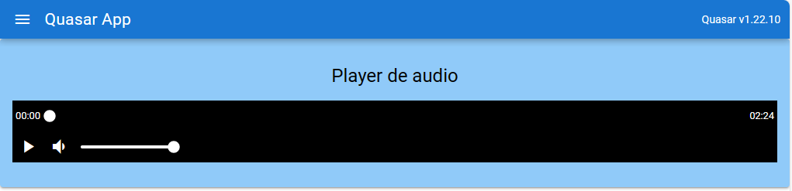
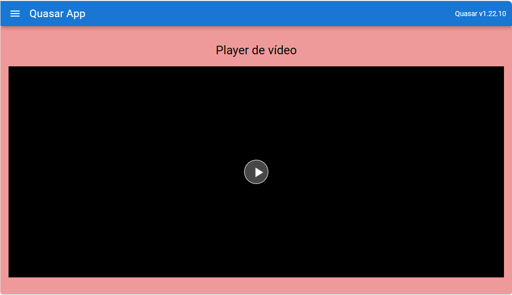

# Quasar App (quasar-with-qmedia-player)

Montando e configurando algumas páginas para exibir players de audio e de vídeo. O projeto conta com 3 páginas, uma apenas com uma imagem e as outras duas com players de audio e de vídeo.

## Resultado
### Menu lateral

### Página inicial

### Player de audio

### Player de vídeo

